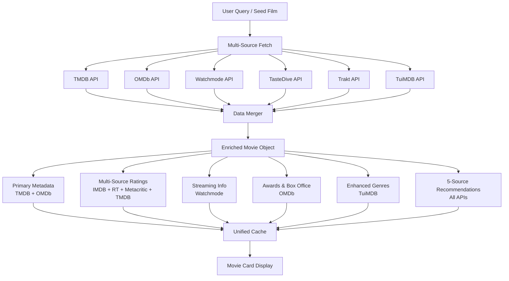

# Complete API Data Extraction Map

## Overview

This document details **every piece of data** we extract from each API to ensure maximum value.

---

## 📊 Data Extraction by API

### TasteDive API - Cross-Media Discovery Engine

| Data Type | Field | Usage |
|-----------|-------|-------|
| **Similar Movies** | `Results[].Name` | Recommendation source |
| **Cross-Media Links** | Query with books/music/games | Unique discovery |
| **Wikipedia Summary** | `Results[].wTeaser` | Plot enrichment |
| **Wikipedia URL** | `Results[].wUrl` | External link for context |
| **YouTube Trailer** | `Results[].yUrl` | Trailer embedding |
| **YouTube ID** | `Results[].yID` | Video player integration |
| **Content Type** | `Results[].Type` | Cross-media filtering |

**Total Data Points:** 7 per recommendation

---

### Watchmode API - Streaming & Entertainment Hub

| Data Type | Field | Usage |
|-----------|-------|-------|
| **Streaming Sources** | `/sources` response | "Watch on Netflix" badges |
| **Source Name** | `source.name` | Service identification |
| **Source Type** | `source.type` (sub/buy/rent) | Availability type |
| **Price** | `source.price` | Cost tracking |
| **Format** | `source.format` (4K/HD/SD) | Quality info |
| **Web URL** | `source.web_url` | Direct link to watch |
| **Region** | `source.region` | Geo availability |
| **Title ID** | `/title/{id}` response | ID mapping |
| **TMDB ID** | `title.tmdb_id` | Cross-reference |
| **IMDB ID** | `title.imdb_id` | Cross-reference |
| **User Rating** | `title.user_rating` | Alternative rating |
| **Release Year** | `title.year` | Metadata |
| **Runtime** | `title.runtime_minutes` | Duration |
| **Genres** | `title.genres[]` | Genre IDs |
| **Cast** | `/cast-crew` endpoint | Actor data |
| **Crew** | `/cast-crew` endpoint | Director/writer |
| **Person Details** | `/person/{id}` | Filmography |
| **Trending Lists** | `/list-titles` | Popular films |
| **New Releases** | `/releases` | Recent additions |
| **Network Info** | `/networks` | Studio data |
| **Genre Taxonomy** | `/genres` | Genre mapping |

**Total Data Points:** 20+ per title

---

### OMDb API - IMDB-Powered Metadata

| Data Type | Field | Usage |
|-----------|-------|-------|
| **IMDB Rating** | `imdbRating` | PRIMARY rating display |
| **IMDB Votes** | `imdbVotes` | Rating confidence |
| **Rotten Tomatoes** | `Ratings[0].Value` | Critics score |
| **Metacritic** | `Ratings[1].Value` | Aggregated critics |
| **Awards** | `Awards` | Oscar/Golden Globe wins |
| **Box Office** | `BoxOffice` | Commercial success |
| **Budget** | `Budget` | Production cost |
| **Title** | `Title` | Movie name |
| **Year** | `Year` | Release year |
| **Rated** | `Rated` | Content rating (PG-13, R) |
| **Runtime** | `Runtime` | Duration |
| **Genre** | `Genre` | Genre string |
| **Director** | `Director` | Director name |
| **Writer** | `Writer` | Screenplay credit |
| **Actors** | `Actors` | Main cast (comma-separated) |
| **Plot** | `Plot` | Full or short summary |
| **Language** | `Language` | Original language |
| **Country** | `Country` | Production country |
| **Poster** | `Poster` | High-res poster URL |
| **Production** | `Production` | Production company |
| **Website** | `Website` | Official site |
| **DVD Release** | `DVD` | Home video date |
| **IMDB ID** | `imdbID` | Cross-reference |

**Total Data Points:** 23 per title

---

### TMDB API - Existing Primary Source

| Data Type | Field | Usage |
|-----------|-------|-------|
| **TMDB ID** | `id` | Primary identifier |
| **Title** | `title` | Movie name |
| **Original Title** | `original_title` | Non-English titles |
| **Release Date** | `release_date` | Release info |
| **Poster** | `poster_path` | Image CDN |
| **Backdrop** | `backdrop_path` | Hero image |
| **Overview** | `overview` | Plot summary |
| **TMDB Rating** | `vote_average` | Community rating |
| **Vote Count** | `vote_count` | Rating confidence |
| **Popularity** | `popularity` | Trending score |
| **Genres** | `genres[]` | Genre objects |
| **Cast** | `credits.cast[]` | Actor data |
| **Crew** | `credits.crew[]` | Director/writer |
| **Keywords** | `keywords.keywords[]` | Themes/tags |
| **Videos** | `videos.results[]` | Trailers |
| **Images** | `images` | All artwork |
| **Similar** | `/similar` endpoint | Recommendations |
| **Recommendations** | `/recommendations` | ML-based recs |
| **Production Companies** | `production_companies[]` | Studios |
| **Production Countries** | `production_countries[]` | Origin |
| **Runtime** | `runtime` | Duration |
| **Budget** | `budget` | Production cost |
| **Revenue** | `revenue` | Box office |
| **IMDB ID** | `imdb_id` | Cross-reference |
| **Status** | `status` | Released/Upcoming |

**Total Data Points:** 25+ per title

---

### TuiMDB API - Enhanced Genres (Keep for Seasonal)

| Data Type | Field | Usage |
|-----------|-------|-------|
| **TuiMDB UID** | `UID` | Internal ID |
| **Enhanced Genres** | `genres[]` | 62 genre types |
| **Seasonal Genres** | Special genres | Christmas/Halloween |
| **Niche Genres** | Anime, Stand-Up | Subgenre detection |
| **Keywords** | `keywords[]` | Thematic tags |
| **Title** | `Title` | Movie name |
| **Release Date** | `ReleaseDate` | Date info |
| **Rating** | `Rating` | Community score |

**Total Data Points:** 8 per title (for genre enrichment only)

---

### Trakt API - Existing Integration

| Data Type | Field | Usage |
|-----------|-------|-------|
| **Related Movies** | `/related` endpoint | Recommendation source |
| **TMDB ID** | `ids.tmdb` | Cross-reference |
| **IMDB ID** | `ids.imdb` | Cross-reference |
| **Trakt ID** | `ids.trakt` | Internal ID |
| **Title** | `title` | Movie name |
| **Year** | `year` | Release year |

**Total Data Points:** 6 per related title

---

## 🎯 Complete Data Pipeline



---

## 📋 Merged Movie Object Schema

```typescript
type EnrichedMovie = {
  // Primary IDs (from TMDB + Watchmode + OMDb)
  tmdb_id: number;
  imdb_id: string;
  watchmode_id?: number;
  tuimdb_uid?: number;
  trakt_id?: number;
  
  // Basic Info (TMDB + OMDb merge)
  title: string;
  original_title?: string;
  year: number;
  release_date: string;
  runtime: number;
  
  // Visuals (TMDB primary, OMDb fallback)
  poster_path: string;
  backdrop_path: string;
  poster_omdb?: string; // Fallback
  
  // Plot (OMDb full > TMDB > TasteDive Wikipedia)
  plot_short: string;
  plot_full?: string;
  wikipedia_summary?: string;
  wikipedia_url?: string;
  
  // Ratings (ALL SOURCES)
  ratings: {
    imdb: { value: string; votes: string }; // OMDb
    tmdb: { value: number; votes: number }; // TMDB
    rotten_tomatoes?: string; // OMDb
    metacritic?: string; // OMDb
    watchmode?: number; // Watchmode
  };
  
  // Genres (TMDB + TuiMDB merge)
  genres: Array<{ id: number; name: string; source: 'tmdb' | 'tuimdb' }>;
  seasonal_genres?: string[]; // Christmas, Halloween from TuiMDB
  
  // Cast & Crew (TMDB + Watchmode + OMDb)
  cast: Array<{
    id: number;
    name: string;
    character?: string;
    order?: number;
  }>;
  director: string[];
  writer: string[];
  
  // Awards (OMDb)
  awards?: string; // "Won 3 Oscars. 145 wins & 142 nominations"
  
  // Box Office (OMDb + TMDB)
  box_office?: string;
  budget?: number;
  revenue?: number;
  
  // Content Rating (OMDb)
  rated?: string; // PG-13, R, etc.
  
  // Streaming (Watchmode)
  streaming_sources?: Array<{
    name: string;
    type: 'sub' | 'buy' | 'rent' | 'free';
    price?: number;
    format?: '4K' | 'HD' | 'SD';
    url?: string;
    region: string;
  }>;
  
  // Recommendations (Multi-source aggregated)
  recommendations: {
    sources: {
      tmdb: number[]; // TMDB IDs
      tastedive: string[]; // Movie names
      trakt: number[]; // TMDB IDs
      tuimdb: number[]; // TuiMDB UIDs
      watchmode: number[]; // Watchmode IDs
    };
    aggregated: Array<{
      tmdb_id: number;
      score: number;
      consensus_level: 'high' | 'medium' | 'low';
      source_count: number;
    }>;
  };
  
  // Enrichment (TasteDive)
  youtube_trailer?: string;
  
  // Keywords (TMDB + TuiMDB)
  keywords: string[];
  
  // Production (TMDB + OMDb)
  production_companies: string[];
  production_countries: string[];
  language: string;
  
  // Metadata
  fetched_at: Date;
  sources_used: Array<'tmdb' | 'omdb' | 'watchmode' | 'tastedive' | 'trakt' | 'tuimdb'>;
};
```

---

## 🔄 Caching Strategy by Data Type

| Data Type | TTL | Reason |
|-----------|-----|--------|
| **TMDB Metadata** | Indefinite | Rarely changes |
| **OMDb Ratings** | 7 days | IMDB updates weekly |
| **Watchmode Streaming** | 24 hours | Changes daily |
| **TasteDive Recommendations** | 30 days | Stable over time |
| **Trakt Related** | 7 days | Community-driven, stable |
| **TuiMDB Genres** | Indefinite | Genres don't change |
| **Watchmode Trending** | 6 hours | Real-time popularity |

---

## 📊 Data Volume Estimates

**Per Movie Card Display:**
- TMDB: 1 request (cached)
- OMDb: 1 request (parallel with TMDB)
- Watchmode: 1 request (on-demand/lazy)
- TasteDive: 0 (batch during recommendation generation)
- Trakt: 0 (batch during recommendation generation)
- TuiMDB: 0 (genre enrichment only)

**Per Recommendation Generation:**
- TMDB: 10-20 requests (similar movies for top seeds)
- TasteDive: 1-5 requests (batch multi-query)
- Trakt: 10 requests (related movies)
- Watchmode: 1 request (trending list)
- TuiMDB: 5 requests (genre matching)

**Daily Budget:**
- OMDb: 1,000/day ✅ (should suffice with caching)
- TasteDive: 7,200/day (300/hour) ✅
- Watchmode: Check plan limits
- TMDB: No fixed limit
- Trakt: 1,000 calls / 5 minutes

---

## ✅ Implementation Checklist

### Data Extraction
- [ ] TasteDive: Extract all 7 fields (Name, Type, wTeaser, wUrl, yUrl, yID, etc.)
- [ ] Watchmode: Extract all 20+ fields (sources, IDs, cast, trending, etc.)
- [ ] OMDb: Extract all 23 fields (ratings, awards, box office, etc.)
- [ ] TMDB: Continue using all 25+ fields
- [ ] Trakt: Use existing 6 fields
- [ ] TuiMDB: Use 8 fields for genres only

### Database Schema
- [ ] Add OMDb fields to `tmdb_movies` table
- [ ] Create `streaming_sources` table for Watchmode
- [ ] Create `recommendations_cache` table for multi-source
- [ ] Add `awards`, `box_office`, `metascore` columns
- [ ] Add `watchmode_id`, `tuimdb_uid` foreign keys

### API Clients
- [ ] `tastedive.ts` - Extract all fields with `info=1`
- [ ] `watchmode.ts` - Use all endpoints (sources, details, trending, cast)
- [ ] `omdb.ts` - Parse all response fields
- [ ] Extend `movieAPI.ts` with merged data functions

### UI Components
- [ ] MovieCard: Display IMDB + RT + Metacritic ratings
- [ ] MovieCard: Show awards badge ("🏆 Won 3 Oscars")
- [ ] MovieCard: Streaming badges with prices
- [ ] MovieCard: Consensus level indicator for recommendations
- [ ] New section: "Trending on Netflix"
- [ ] New section: "Award Winners You Haven't Seen"

---

This comprehensive map ensures we **maximize value** from every API call!
