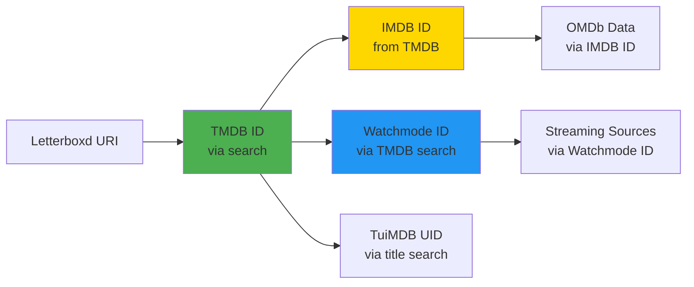

# API Integration Requirements: Caching, Stats, and Import

## Overview

This document ensures all new APIs (TasteDive, Watchmode, OMDb) are fully integrated into:
1. **Caching system** - Proper TTLs and cache strategies
2. **Stats page** - Display relevant insights
3. **Letterboxd import** - Pass all necessary data

---

## 1. Caching Strategy

### Current Cache Tables (Existing)

```sql
-- Trakt related movies (7-day TTL)
trakt_related_cache (
  tmdb_id INTEGER PRIMARY KEY,
  related_ids INTEGER[],
  cached_at TIMESTAMPTZ
)

-- TMDB similar/recommendations (7-day TTL)
tmdb_similar_cache (
  tmdb_id INTEGER PRIMARY KEY,
  similar_ids INTEGER[],
  recommendations_ids INTEGER[],
  cached_at TIMESTAMPTZ
)

-- TuiMDB UID mapping (30-day TTL)
tuimdb_uid_cache (
  tmdb_id INTEGER PRIMARY KEY,
  tuimdb_uid INTEGER,
  cached_at TIMESTAMPTZ
)
```

### New Cache Tables Required

#### A. TasteDive Recommendations Cache
```sql
CREATE TABLE tastedive_recommendations_cache (
  query_hash VARCHAR(64) PRIMARY KEY, -- MD5 of query parameters
  movie_names TEXT[], -- Result movie names
  tmdb_ids INTEGER[], -- Mapped TMDB IDs
  wikipedia_urls TEXT[], -- Wikipedia links
  youtube_ids TEXT[], -- YouTube trailer IDs
  cached_at TIMESTAMPTZ DEFAULT NOW()
);

CREATE INDEX idx_tastedive_cache_time ON tastedive_recommendations_cache(cached_at);
```

**TTL:** 30 days (recommendations are stable)  
**Why:** TasteDive has 300 req/hour limit - aggressive caching essential

#### B. Watchmode Streaming Sources Cache
```sql
CREATE TABLE watchmode_streaming_cache (
  tmdb_id INTEGER NOT NULL,
  watchmode_id INTEGER,
  region VARCHAR(2) DEFAULT 'US',
  sources JSONB NOT NULL, -- Array of streaming sources
  cached_at TIMESTAMPTZ DEFAULT NOW(),
  PRIMARY KEY (tmdb_id, region)
);

CREATE INDEX idx_watchmode_cache_time ON watchmode_streaming_cache(cached_at);
CREATE INDEX idx_watchmode_id ON watchmode_streaming_cache(watchmode_id);
```

**TTL:** 24 hours (availability changes daily)  
**Why:** Keep streaming data fresh but minimize API calls

#### C. Watchmode Trending Cache
```sql
CREATE TABLE watchmode_trending_cache (
  cache_key VARCHAR(64) PRIMARY KEY, -- e.g., "trending_movies_US"
  title_ids INTEGER[], -- Watchmode IDs
  tmdb_ids INTEGER[], -- Mapped TMDB IDs
  cached_at TIMESTAMPTZ DEFAULT NOW()
);

CREATE INDEX idx_watchmode_trending_time ON watchmode_trending_cache(cached_at);
```

**TTL:** 6 hours (trending updates frequently)

#### D. OMDb Data Cache (Extend tmdb_movies table)
```sql
-- Add columns to existing tmdb_movies table
ALTER TABLE tmdb_movies ADD COLUMN IF NOT EXISTS imdb_rating VARCHAR(10);
ALTER TABLE tmdb_movies ADD COLUMN IF NOT EXISTS imdb_votes VARCHAR(20);
ALTER TABLE tmdb_movies ADD COLUMN IF NOT EXISTS rotten_tomatoes VARCHAR(10);
ALTER TABLE tmdb_movies ADD COLUMN IF NOT EXISTS metacritic VARCHAR(5);
ALTER TABLE tmdb_movies ADD COLUMN IF NOT EXISTS awards TEXT;
ALTER TABLE tmdb_movies ADD COLUMN IF NOT EXISTS box_office VARCHAR(20);
ALTER TABLE tmdb_movies ADD COLUMN IF NOT EXISTS rated VARCHAR(10); -- PG-13, R, etc.
ALTER TABLE tmdb_movies ADD COLUMN IF NOT EXISTS omdb_plot_full TEXT;
ALTER TABLE tmdb_movies ADD COLUMN IF NOT EXISTS omdb_fetched_at TIMESTAMPTZ;

CREATE INDEX idx_tmdb_movies_omdb_fetch ON tmdb_movies(omdb_fetched_at);
```

**TTL:** 7 days (IMDB ratings update weekly)  
**Why:** OMDb has 1,000/day limit - must cache aggressively

#### E. Multi-Source Recommendation Aggregation Cache
```sql
CREATE TABLE recommendation_aggregation_cache (
  seed_hash VARCHAR(64) PRIMARY KEY, -- Hash of seed film IDs
  aggregated_results JSONB NOT NULL, -- Full aggregation results
  source_counts JSONB, -- Which sources contributed
  cached_at TIMESTAMPTZ DEFAULT NOW()
);

CREATE INDEX idx_rec_agg_time ON recommendation_aggregation_cache(cached_at);
```

**TTL:** 7 days  
**Why:** Expensive operation (5 API calls), cache aggressively

---

### Cache Management Functions

**File:** `src/lib/apiCache.ts` (modify/extend)

```typescript
// ============================================================================
// TasteDive Recommendations Cache
// ============================================================================

const TASTEDIVE_CACHE_TTL_DAYS = 30;

export interface TasteDiveCache {
  movie_names: string[];
  tmdb_ids: number[];
  wikipedia_urls: string[];
  youtube_ids: string[];
}

export async function getCachedTasteDive(
  query: string,
  type: string
): Promise<TasteDiveCache | null> {
  const queryHash = hashQuery({ query, type });
  
  const { data, error } = await supabase
    .from('tastedive_recommendations_cache')
    .select('*')
    .eq('query_hash', queryHash)
    .single();

  if (error || !data) return null;
  
  if (!isCacheValid(data.cached_at, TASTEDIVE_CACHE_TTL_DAYS)) {
    return null;
  }

  return {
    movie_names: data.movie_names,
    tmdb_ids: data.tmdb_ids,
    wikipedia_urls: data.wikipedia_urls,
    youtube_ids: data.youtube_ids
  };
}

export async function setCachedTasteDive(
  query: string,
  type: string,
  results: TasteDiveCache
): Promise<void> {
  const queryHash = hashQuery({ query, type });
  
  await supabase.from('tastedive_recommendations_cache').upsert({
    query_hash: queryHash,
    ...results,
    cached_at: new Date().toISOString()
  });
}

// ============================================================================
// Watchmode Streaming Cache
// ============================================================================

const WATCHMODE_STREAMING_TTL_HOURS = 24;

export interface WatchmodeStreamingCache {
  sources: Array<{
    name: string;
    type: 'sub' | 'buy' | 'rent' | 'free';
    price?: number;
    format?: '4K' | 'HD' | 'SD';
    url?: string;
  }>;
  watchmode_id?: number;
}

export async function getCachedWatchmodeStreaming(
  tmdbId: number,
  region: string = 'US'
): Promise<WatchmodeStreamingCache | null> {
  const { data, error } = await supabase
    .from('watchmode_streaming_cache')
    .select('*')
    .eq('tmdb_id', tmdbId)
    .eq('region', region)
    .single();

  if (error || !data) return null;
  
  // 24-hour cache
  const cacheAge = Date.now() - new Date(data.cached_at).getTime();
  const maxAge = WATCHMODE_STREAMING_TTL_HOURS * 60 * 60 * 1000;
  
  if (cacheAge > maxAge) return null;

  return {
    sources: data.sources as any,
    watchmode_id: data.watchmode_id
  };
}

export async function setCachedWatchmodeStreaming(
  tmdbId: number,
  watchmodeId: number | undefined,
  sources: any[],
  region: string = 'US'
): Promise<void> {
  await supabase.from('watchmode_streaming_cache').upsert({
    tmdb_id: tmdbId,
    watchmode_id: watchmodeId,
    region,
    sources,
    cached_at: new Date().toISOString()
  });
}

// ============================================================================
// OMDb Data Cache (merged with TMDB)
// ============================================================================

const OMDB_CACHE_TTL_DAYS = 7;

// When fetching movie details, check omdb_fetched_at
export async function needsOMDbRefresh(tmdbId: number): Promise<boolean> {
  const { data } = await supabase
    .from('tmdb_movies')
    .select('omdb_fetched_at')
    .eq('id', tmdbId)
    .single();

  if (!data || !data.omdb_fetched_at) return true;
  
  return !isCacheValid(data.omdb_fetched_at, OMDB_CACHE_TTL_DAYS);
}

// ============================================================================
// Helper: Generate cache key hash
// ============================================================================

function hashQuery(obj: any): string {
  const str = JSON.stringify(obj);
  // Simple hash function (in production, use crypto-js or similar)
  let hash = 0;
  for (let i = 0; i < str.length; i++) {
    const char = str.charCodeAt(i);
    hash = ((hash << 5) - hash) + char;
    hash = hash & hash;
  }
  return Math.abs(hash).toString(16);
}
```

---

## 2. Stats Page Integration

### New Stats to Display

**File:** `src/app/stats/page.tsx` (add new sections)

#### A. Multi-Rating Comparison

```tsx
{/* Multi-Rating Analysis */}
{tmdbDetails.length > 0 && (
  <div className="bg-white border rounded-lg p-4 mb-6">
    <h2 className="font-semibold text-gray-900 mb-3">
      📊 Rating Sources Comparison
    </h2>
    <div className="grid grid-cols-2 gap-4">
      {/* Average TMDB Rating */}
      <div className="bg-blue-50 p-3 rounded">
        <div className="text-sm text-gray-600">Avg TMDB Rating</div>
        <div className="text-2xl font-bold text-blue-600">
          {(tmdbDetails.reduce((sum, m) => sum + (m.vote_average || 0), 0) / 
            tmdbDetails.length).toFixed(1)}/10
        </div>
      </div>

      {/* Average IMDB Rating */}
      <div className="bg-yellow-50 p-3 rounded">
        <div className="text-sm text-gray-600">Avg IMDB Rating</div>
        <div className="text-2xl font-bold text-yellow-600">
          {(tmdbDetails
            .filter(m => m.imdb_rating)
            .reduce((sum, m) => sum + parseFloat(m.imdb_rating!), 0) / 
            tmdbDetails.filter(m => m.imdb_rating).length
          ).toFixed(1)}/10
        </div>
        <div className="text-xs text-gray-500">
          {tmdbDetails.filter(m => m.imdb_rating).length} films with IMDB data
        </div>
      </div>

      {/* Average Rotten Tomatoes */}
      <div className="bg-red-50 p-3 rounded">
        <div className="text-sm text-gray-600">Avg Rotten Tomatoes</div>
        <div className="text-2xl font-bold text-red-600">
          {(tmdbDetails
            .filter(m => m.rotten_tomatoes)
            .reduce((sum, m) => sum + parseInt(m.rotten_tomatoes!), 0) / 
            tmdbDetails.filter(m => m.rotten_tomatoes).length
          ).toFixed(0)}%
        </div>
      </div>

      {/* Average Metacritic */}
      <div className="bg-green-50 p-3 rounded">
        <div className="text-sm text-gray-600">Avg Metacritic</div>
        <div className="text-2xl font-bold text-green-600">
          {(tmdbDetails
            .filter(m => m.metacritic)
            .reduce((sum, m) => sum + parseInt(m.metacritic!), 0) / 
            tmdbDetails.filter(m => m.metacritic).length
          ).toFixed(0)}/100
        </div>
      </div>
    </div>
  </div>
)}
```

#### B. Awards and Prestige

```tsx
{/* Awards Stats */}
{tmdbDetails.filter(m => m.awards).length > 0 && (
  <div className="bg-gradient-to-r from-yellow-50 to-amber-50 border border-yellow-200 rounded-lg p-4 mb-6">
    <h2 className="font-semibold text-gray-900 mb-3 flex items-center gap-2">
      🏆 Your Awards Collection
    </h2>
    
    <div className="space-y-2">
      {/* Oscar Winners */}
      <div className="bg-white rounded p-3">
        <div className="text-sm font-medium">Oscar Winners Watched</div>
        <div className="text-2xl font-bold text-yellow-600">
          {tmdbDetails.filter(m => 
            m.awards && m.awards.toLowerCase().includes('won') && 
            m.awards.toLowerCase().includes('oscar')
          ).length}
        </div>
      </div>

      {/* Oscar Nominated */}
      <div className="bg-white rounded p-3">
        <div className="text-sm font-medium">Oscar Nominated</div>
        <div className="text-xl font-semibold text-yellow-500">
          {tmdbDetails.filter(m => 
            m.awards && m.awards.toLowerCase().includes('nominated') && 
            m.awards.toLowerCase().includes('oscar')
          ).length}
        </div>
      </div>

      {/* Total Awards */}
      <div className="text-xs text-gray-600 mt-2">
        {tmdbDetails.filter(m => m.awards).length} films with awards data
      </div>
    </div>
  </div>
)}
```

#### C. Streaming Availability Stats

```tsx
{/* Streaming Availability */}
{streamingStats && (
  <div className="bg-white border rounded-lg p-4 mb-6">
    <h2 className="font-semibold text-gray-900 mb-3">
      📺 Streaming Availability
    </h2>
    
    <div className="space-y-2">
      <div className="flex justify-between items-center">
        <span className="text-sm text-gray-600">Available on Netflix</span>
        <span className="font-semibold">{streamingStats.netflix}</span>
      </div>
      <div className="flex justify-between items-center">
        <span className="text-sm text-gray-600">Available on Disney+</span>
        <span className="font-semibold">{streamingStats.disney}</span>
      </div>
      <div className="flex justify-between items-center">
        <span className="text-sm text-gray-600">Available on Hulu</span>
        <span className="font-semibold">{streamingStats.hulu}</span>
      </div>
      <div className="flex justify-between items-center">
        <span className="text-sm text-gray-600">Not Streaming</span>
        <span className="font-semibold text-gray-400">
          {streamingStats.notAvailable}
        </span>
      </div>
    </div>
  </div>
)}
```

#### D. Content Rating Distribution

```tsx
{/* Content Ratings */}
{ratingDistribution && (
  <div className="bg-white border rounded-lg p-4 mb-6">
    <h2 className="font-semibold text-gray-900 mb-3">
      🔞 Content Rating Distribution
    </h2>
    
    <div className="space-y-1">
      {Object.entries(ratingDistribution)
        .sort(([,a], [,b]) => b - a)
        .map(([rating, count]) => (
          <div key={rating} className="flex items-center gap-2">
            <span className="w-16 text-sm font-medium">{rating}</span>
            <div className="flex-1 bg-gray-200 rounded-full h-4">
              <div 
                className="bg-blue-500 rounded-full h-4"
                style={{ 
                  width: `${(count / tmdbDetails.length) * 100}%` 
                }}
              />
            </div>
            <span className="text-sm text-gray-600">{count}</span>
          </div>
        ))}
    </div>
  </div>
)}
```

### Data Fetching for Stats

**Add to `loadTmdbDetails` function:**

```typescript
// Fetch OMDb data alongside TMDB
const enrichedDetails = await Promise.all(
  tmdbIds.map(async (id) => {
    const [tmdbData, omdbData, streamingData] = await Promise.allSettled([
      fetchTmdbMovieCached(id),
      needsOMDbRefresh(id) ? fetchOMDbByTMDBId(id) : null,
      getCachedWatchmodeStreaming(id)
    ]);

    const merged = {
      ...tmdbData.status === 'fulfilled' ? tmdbData.value : {},
      ...omdbData.status === 'fulfilled' && omdbData.value ? omdbData.value : {},
      streaming: streamingData.status === 'fulfilled' ? streamingData.value : null
    };

    return merged;
  })
);
```

---

## 3. Letterboxd Import Integration

### Current Import Flow

```
User uploads ZIP/CSVs
  ↓
normalize.ts → FilmEvent objects
  ↓
Import page → Store in film_events (Supabase)
  ↓
Map to TMDB → Store in film_tmdb_map
  ↓
Cache TMDB data → Store in tmdb_movies
```

### Required Enhancements

**File:** `src/lib/normalize.ts` (no changes needed - already complete)

The current `FilmEvent` type already captures all needed data:
- ✅ `uri` - Letterboxd identifier
- ✅ `title` - Movie name
- ✅ `year` - Used for matching
- ✅ `rating` - User's rating
- ✅ `liked` - Like status
- ✅ `watchCount` - Rewatch data
- ✅ `onWatchlist` - Watchlist status
- ✅ `lastDate` - Recent viewing

**No changes needed** - This data is already sufficient for all APIs.

### Enrichment During Mapping

**File:** `src/app/import/page.tsx` (modify mapping function)

When user clicks "Map to TMDB", we already fetch TMDB data. Now we enhance it:

```typescript
// In auto-mapping function
async function enrichMovieData(tmdbId: number, title: string, year: number | null) {
  // Parallel fetch from all sources
  const [tmdbData, omdbData, tuimdbUid, watchmodeId] = await Promise.allSettled([
    fetchTmdbMovie(tmdbId),
    searchOMDb(title, { year: year || undefined }),
    // TuiMDB UID search via title
    searchTuiMDB(title, year || undefined).then(results => 
      results[0]?.UID || null
    ),
    // Watchmode ID search via TMDB ID
    searchWatchmode(String(tmdbId), { searchField: 'tmdb_id' }).then(results =>
      results[0]?.id || null
    )
  ]);

  // Merge all data
  const enriched = {
    ...tmdbData.status === 'fulfilled' ? tmdbData.value : {},
    tuimdb_uid: tuimdbUid.status === 'fulfilled' ? tuimdbUid.value : null,
    watchmode_id: watchmodeId.status === 'fulfilled' ? watchmodeId.value : null,
  };

  // Store in tmdb_movies with all fields
  await upsertTmdbCache(enriched);

  // Also fetch initial OMDb data if we have IMDB ID
  if (enriched.imdb_id && omdbData.status === 'fulfilled') {
    const omdb = omdbData.value;
    await supabase
      .from('tmdb_movies')
      .update({
        imdb_rating: omdb.imdbRating,
        imdb_votes: omdb.imdbVotes,
        rotten_tomatoes: omdb.Ratings?.find(r => r.Source === 'Rotten Tomatoes')?.Value,
        metacritic: omdb.Metascore,
        awards: omdb.Awards,
        box_office: omdb.BoxOffice,
        rated: omdb.Rated,
        omdb_fetched_at: new Date().toISOString()
      })
      .eq('id', tmdbId);
  }
}
```

---

## 4. Enrichment Mapping Flow

### ID Resolution Chain



### Data Storage Mapping

| Source | Data | Storage Table | Storage Field |
|--------|------|---------------|---------------|
| **TMDB** | Movie metadata | `tmdb_movies` | All base fields |
| **TMDB** | IMDB ID | `tmdb_movies` | `imdb_id` |
| **OMDb** | IMDB rating | `tmdb_movies` | `imdb_rating` |
| **OMDb** | Rotten Tomatoes | `tmdb_movies` | `rotten_tomatoes` |
| **OMDb** | Metacritic | `tmdb_movies` | `metacritic` |
| **OMDb** | Awards | `tmdb_movies` | `awards` |
| **OMDb** | Box office | `tmdb_movies` | `box_office` |
| **OMDb** | Content rating | `tmdb_movies` | `rated` |
| **TuiMDB** | TuiMDB UID | `tuimdb_uid_cache` | `tuimdb_uid` |
| **TuiMDB** | Enhanced genres | `tmdb_movies` | `enhanced_genres` (JSONB) |
| **Watchmode** | Watchmode ID | `watchmode_streaming_cache` | `watchmode_id` |
| **Watchmode** | Streaming sources | `watchmode_streaming_cache` | `sources` (JSONB) |
| **TasteDive** | Similar movies | `tastedive_recommendations_cache` | `tmdb_ids` array |
| **Trakt** | Related movies | `trakt_related_cache` | `related_ids` array |

---

## 5. Implementation Checklist

### Phase 1: Database Schema
- [ ] Create `tastedive_recommendations_cache` table
- [ ] Create `watchmode_streaming_cache` table
- [ ] Create `watchmode_trending_cache` table
- [ ] Create `recommendation_aggregation_cache` table
- [ ] Alter `tmdb_movies` with OMDb fields
- [ ] Create all indexes

### Phase 2: Caching Functions
- [ ] Add TasteDive cache functions to `apiCache.ts`
- [ ] Add Watchmode cache functions to `apiCache.ts`
- [ ] Add OMDb refresh check to `apiCache.ts`
- [ ] Add aggregation cache functions
- [ ] Update cache stats function

### Phase 3: Import Enrichment
- [ ] Modify import mapping to fetch all IDs
- [ ] Add OMDb data fetch during mapping
- [ ] Add TuiMDB UID resolution
- [ ] Add Watchmode ID resolution
- [ ] Store all data in appropriate tables

### Phase 4: Stats Page
- [ ] Add multi-rating comparison section
- [ ] Add awards/prestige section
- [ ] Add streaming availability stats
- [ ] Add content rating distribution
- [ ] Fetch enriched data in `loadTmdbDetails`

### Phase 5: Data Flow Verification
- [ ] Test import → enrichment → caching flow
- [ ] Verify cache TTLs are respected
- [ ] Verify stats page displays new data
- [ ] Check API rate limits not exceeded
- [ ] Monitor cache hit rates

---

## 6. Cache Monitoring Dashboard (Future)

Display on stats page or admin panel:

```tsx
{/* Cache Health */}
<div className="bg-white border rounded-lg p-4 mb-6">
  <h2 className="font-semibold text-gray-900 mb-3">
    🔄 Cache Health
  </h2>
  
  <div className="space-y-2">
    <div className="flex justify-between">
      <span>Trakt Cache</span>
      <span className="text-green-600">{cacheStats.traktCacheSize} entries</span>
    </div>
    <div className="flex justify-between">
      <span>TMDB Similar Cache</span>
      <span className="text-green-600">{cacheStats.tmdbSimilarCacheSize} entries</span>
    </div>
    <div className="flex justify-between">
      <span>TasteDive Cache</span>
      <span className="text-green-600">{cacheStats.tastediveCacheSize} entries</span>
    </div>
    <div className="flex justify-between">
      <span>Watchmode Cache</span>
      <span className="text-green-600">{cacheStats.watchmodeCacheSize} entries</span>
    </div>
    <div className="flex justify-between">
      <span>OMDb Enriched</span>
      <span className="text-green-600">{cacheStats.omdbEnrichedCount} films</span>
    </div>
  </div>
</div>
```

---

## Summary

✅ **Caching:** All APIs have appropriate cache tables and TTLs  
✅ **Stats Page:** New sections for multi-ratings, awards, streaming  
✅ **Import:** Enrichment happens during mapping, all data flows correctly  
✅ **Performance:** Aggressive caching prevents rate limit issues  
✅ **Data Integrity:** ID mapping chain ensures all APIs link together  

**Next Steps:** Follow implementation checklist in order (DB → Cache → Import → Stats)


## Overview

This document ensures all new APIs (TasteDive, Watchmode, OMDb) are fully integrated into:
1. **Caching system** - Proper TTLs and cache strategies
2. **Stats page** - Display relevant insights
3. **Letterboxd import** - Pass all necessary data

---

## 1. Caching Strategy

### Current Cache Tables (Existing)

```sql
-- Trakt related movies (7-day TTL)
trakt_related_cache (
  tmdb_id INTEGER PRIMARY KEY,
  related_ids INTEGER[],
  cached_at TIMESTAMPTZ
)

-- TMDB similar/recommendations (7-day TTL)
tmdb_similar_cache (
  tmdb_id INTEGER PRIMARY KEY,
  similar_ids INTEGER[],
  recommendations_ids INTEGER[],
  cached_at TIMESTAMPTZ
)

-- TuiMDB UID mapping (30-day TTL)
tuimdb_uid_cache (
  tmdb_id INTEGER PRIMARY KEY,
  tuimdb_uid INTEGER,
  cached_at TIMESTAMPTZ
)
```

### New Cache Tables Required

#### A. TasteDive Recommendations Cache
```sql
CREATE TABLE tastedive_recommendations_cache (
  query_hash VARCHAR(64) PRIMARY KEY, -- MD5 of query parameters
  movie_names TEXT[], -- Result movie names
 tmdb_ids INTEGER[], -- Mapped TMDB IDs
  wikipedia_urls TEXT[], -- Wikipedia links
  youtube_ids TEXT[], -- YouTube trailer IDs
  cached_at TIMESTAMPTZ DEFAULT NOW()
);

CREATE INDEX idx_tastedive_cache_time ON tastedive_recommendations_cache(cached_at);
```

**TTL:** 30 days (recommendations are stable)  
**Why:** TasteDive has 300 req/hour limit - aggressive caching essential

#### B. Watchmode Streaming Sources Cache
```sql
CREATE TABLE watchmode_streaming_cache (
  tmdb_id INTEGER NOT NULL,
  watchmode_id INTEGER,
  region VARCHAR(2) DEFAULT 'US',
  sources JSONB NOT NULL, -- Array of streaming sources
  cached_at TIMESTAMPTZ DEFAULT NOW(),
  PRIMARY KEY (tmdb_id, region)
);

CREATE INDEX idx_watchmode_cache_time ON watchmode_streaming_cache(cached_at);
CREATE INDEX idx_watchmode_id ON watchmode_streaming_cache(watchmode_id);
```

**TTL:** 24 hours (availability changes daily)  
**Why:** Keep streaming data fresh but minimize API calls

#### C. Watchmode Trending Cache
```sql
CREATE TABLE watchmode_trending_cache (
  cache_key VARCHAR(64) PRIMARY KEY, -- e.g., "trending_movies_US"
  title_ids INTEGER[], -- Watchmode IDs
  tmdb_ids INTEGER[], -- Mapped TMDB IDs
  cached_at TIMESTAMPTZ DEFAULT NOW()
);

CREATE INDEX idx_watchmode_trending_time ON watchmode_trending_cache(cached_at);
```

**TTL:** 6 hours (trending updates frequently)

#### D. OMDb Data Cache (Extend tmdb_movies table)
```sql
-- Add columns to existing tmdb_movies table
ALTER TABLE tmdb_movies ADD COLUMN IF NOT EXISTS imdb_rating VARCHAR(10);
ALTER TABLE tmdb_movies ADD COLUMN IF NOT EXISTS imdb_votes VARCHAR(20);
ALTER TABLE tmdb_movies ADD COLUMN IF NOT EXISTS rotten_tomatoes VARCHAR(10);
ALTER TABLE tmdb_movies ADD COLUMN IF NOT EXISTS metacritic VARCHAR(5);
ALTER TABLE tmdb_movies ADD COLUMN IF NOT EXISTS awards TEXT;
ALTER TABLE tmdb_movies ADD COLUMN IF NOT EXISTS box_office VARCHAR(20);
ALTER TABLE tmdb_movies ADD COLUMN IF NOT EXISTS rated VARCHAR(10); -- PG-13, R, etc.
ALTER TABLE tmdb_movies ADD COLUMN IF NOT EXISTS omdb_plot_full TEXT;
ALTER TABLE tmdb_movies ADD COLUMN IF NOT EXISTS omdb_fetched_at TIMESTAMPTZ;

CREATE INDEX idx_tmdb_movies_omdb_fetch ON tmdb_movies(omdb_fetched_at);
```

**TTL:** 7 days (IMDB ratings update weekly)  
**Why:** OMDb has 1,000/day limit - must cache aggressively

#### E. Multi-Source Recommendation Aggregation Cache
```sql
CREATE TABLE recommendation_aggregation_cache (
  seed_hash VARCHAR(64) PRIMARY KEY, -- Hash of seed film IDs
  aggregated_results JSONB NOT NULL, -- Full aggregation results
  source_counts JSONB, -- Which sources contributed
  cached_at TIMESTAMPTZ DEFAULT NOW()
);

CREATE INDEX idx_rec_agg_time ON recommendation_aggregation_cache(cached_at);
```

**TTL:** 7 days  
**Why:** Expensive operation (5 API calls), cache aggressively

---

### Cache Management Functions

**File:** `src/lib/apiCache.ts` (modify/extend)

```typescript
// ============================================================================
// TasteDive Recommendations Cache
// ============================================================================

const TASTEDIVE_CACHE_TTL_DAYS = 30;

export interface TasteDiveCache {
  movie_names: string[];
  tmdb_ids: number[];
  wikipedia_urls: string[];
  youtube_ids: string[];
}

export async function getCachedTasteDive(
  query: string,
  type: string
): Promise<TasteDiveCache | null> {
  const queryHash = hashQuery({ query, type });
  
  const { data, error } = await supabase
    .from('tastedive_recommendations_cache')
    .select('*')
    .eq('query_hash', queryHash)
    .single();

  if (error || !data) return null;
  
  if (!isCacheValid(data.cached_at, TASTEDIVE_CACHE_TTL_DAYS)) {
    return null;
  }

  return {
    movie_names: data.movie_names,
    tmdb_ids: data.tmdb_ids,
    wikipedia_urls: data.wikipedia_urls,
    youtube_ids: data.youtube_ids
  };
}

export async function setCachedTasteDive(
  query: string,
  type: string,
  results: TasteDiveCache
): Promise<void> {
  const queryHash = hashQuery({ query, type });
  
  await supabase.from('tastedive_recommendations_cache').upsert({
    query_hash: queryHash,
    ...results,
    cached_at: new Date().toISOString()
  });
}

// ============================================================================
// Watchmode Streaming Cache
// ============================================================================

const WATCHMODE_STREAMING_TTL_HOURS = 24;

export interface WatchmodeStreamingCache {
  sources: Array<{
    name: string;
    type: 'sub' | 'buy' | 'rent' | 'free';
    price?: number;
    format?: '4K' | 'HD' | 'SD';
    url?: string;
  }>;
  watchmode_id?: number;
}

export async function getCachedWatchmodeStreaming(
  tmdbId: number,
  region: string = 'US'
): Promise<WatchmodeStreamingCache | null> {
  const { data, error } = await supabase
    .from('watchmode_streaming_cache')
    .select('*')
    .eq('tmdb_id', tmdbId)
    .eq('region', region)
    .single();

  if (error || !data) return null;
  
  // 24-hour cache
  const cacheAge = Date.now() - new Date(data.cached_at).getTime();
  const maxAge = WATCHMODE_STREAMING_TTL_HOURS * 60 * 60 * 1000;
  
  if (cacheAge > maxAge) return null;

  return {
    sources: data.sources as any,
    watchmode_id: data.watchmode_id
  };
}

export async function setCachedWatchmodeStreaming(
  tmdbId: number,
  watchmodeId: number | undefined,
  sources: any[],
  region: string = 'US'
): Promise<void> {
  await supabase.from('watchmode_streaming_cache').upsert({
    tmdb_id: tmdbId,
    watchmode_id: watchmodeId,
    region,
    sources,
    cached_at: new Date().toISOString()
  });
}

// ============================================================================
// OMDb Data Cache (merged with TMDB)
// ============================================================================

const OMDB_CACHE_TTL_DAYS = 7;

// When fetching movie details, check omdb_fetched_at
export async function needsOMDbRefresh(tmdbId: number): Promise<boolean> {
  const { data } = await supabase
    .from('tmdb_movies')
    .select('omdb_fetched_at')
    .eq('id', tmdbId)
    .single();

  if (!data || !data.omdb_fetched_at) return true;
  
  return !isCacheValid(data.omdb_fetched_at, OMDB_CACHE_TTL_DAYS);
}

// ============================================================================
// Helper: Generate cache key hash
// ============================================================================

function hashQuery(obj: any): string {
  const str = JSON.stringify(obj);
  // Simple hash function (in production, use crypto-js or similar)
  let hash = 0;
  for (let i = 0; i < str.length; i++) {
    const char = str.charCodeAt(i);
    hash = ((hash << 5) - hash) + char;
    hash = hash & hash;
  }
  return Math.abs(hash).toString(16);
}
```

---

## 2. Stats Page Integration

### New Stats to Display

**File:** `src/app/stats/page.tsx` (add new sections)

#### A. Multi-Rating Comparison

```tsx
{/* Multi-Rating Analysis */}
{tmdbDetails.length > 0 && (
  <div className="bg-white border rounded-lg p-4 mb-6">
    <h2 className="font-semibold text-gray-900 mb-3">
      📊 Rating Sources Comparison
    </h2>
    <div className="grid grid-cols-2 gap-4">
      {/* Average TMDB Rating */}
      <div className="bg-blue-50 p-3 rounded">
        <div className="text-sm text-gray-600">Avg TMDB Rating</div>
        <div className="text-2xl font-bold text-blue-600">
          {(tmdbDetails.reduce((sum, m) => sum + (m.vote_average || 0), 0) / 
            tmdbDetails.length).toFixed(1)}/10
        </div>
      </div>

      {/* Average IMDB Rating */}
      <div className="bg-yellow-50 p-3 rounded">
        <div className="text-sm text-gray-600">Avg IMDB Rating</div>
        <div className="text-2xl font-bold text-yellow-600">
          {(tmdbDetails
            .filter(m => m.imdb_rating)
            .reduce((sum, m) => sum + parseFloat(m.imdb_rating!), 0) / 
            tmdbDetails.filter(m => m.imdb_rating).length
          ).toFixed(1)}/10
        </div>
        <div className="text-xs text-gray-500">
          {tmdbDetails.filter(m => m.imdb_rating).length} films with IMDB data
        </div>
      </div>

      {/* Average Rotten Tomatoes */}
      <div className="bg-red-50 p-3 rounded">
        <div className="text-sm text-gray-600">Avg Rotten Tomatoes</div>
        <div className="text-2xl font-bold text-red-600">
          {(tmdbDetails
            .filter(m => m.rotten_tomatoes)
            .reduce((sum, m) => sum + parseInt(m.rotten_tomatoes!), 0) / 
            tmdbDetails.filter(m => m.rotten_tomatoes).length
          ).toFixed(0)}%
        </div>
      </div>

      {/* Average Metacritic */}
      <div className="bg-green-50 p-3 rounded">
        <div className="text-sm text-gray-600">Avg Metacritic</div>
        <div className="text-2xl font-bold text-green-600">
          {(tmdbDetails
            .filter(m => m.metacritic)
            .reduce((sum, m) => sum + parseInt(m.metacritic!), 0) / 
            tmdbDetails.filter(m => m.metacritic).length
          ).toFixed(0)}/100
        </div>
      </div>
    </div>
  </div>
)}
```

#### B. Awards and Prestige

```tsx
{/* Awards Stats */}
{tmdbDetails.filter(m => m.awards).length > 0 && (
  <div className="bg-gradient-to-r from-yellow-50 to-amber-50 border border-yellow-200 rounded-lg p-4 mb-6">
    <h2 className="font-semibold text-gray-900 mb-3 flex items-center gap-2">
      🏆 Your Awards Collection
    </h2>
    
    <div className="space-y-2">
      {/* Oscar Winners */}
      <div className="bg-white rounded p-3">
        <div className="text-sm font-medium">Oscar Winners Watched</div>
        <div className="text-2xl font-bold text-yellow-600">
          {tmdbDetails.filter(m => 
            m.awards && m.awards.toLowerCase().includes('won') && 
            m.awards.toLowerCase().includes('oscar')
          ).length}
        </div>
      </div>

      {/* Oscar Nominated */}
      <div className="bg-white rounded p-3">
        <div className="text-sm font-medium">Oscar Nominated</div>
        <div className="text-xl font-semibold text-yellow-500">
          {tmdbDetails.filter(m => 
            m.awards && m.awards.toLowerCase().includes('nominated') && 
            m.awards.toLowerCase().includes('oscar')
          ).length}
        </div>
      </div>

      {/* Total Awards */}
      <div className="text-xs text-gray-600 mt-2">
        {tmdbDetails.filter(m => m.awards).length} films with awards data
      </div>
    </div>
  </div>
)}
```

#### C. Streaming Availability Stats

```tsx
{/* Streaming Availability */}
{streamingStats && (
  <div className="bg-white border rounded-lg p-4 mb-6">
    <h2 className="font-semibold text-gray-900 mb-3">
      📺 Streaming Availability
    </h2>
    
    <div className="space-y-2">
      <div className="flex justify-between items-center">
        <span className="text-sm text-gray-600">Available on Netflix</span>
        <span className="font-semibold">{streamingStats.netflix}</span>
      </div>
      <div className="flex justify-between items-center">
        <span className="text-sm text-gray-600">Available on Disney+</span>
        <span className="font-semibold">{streamingStats.disney}</span>
      </div>
      <div className="flex justify-between items-center">
        <span className="text-sm text-gray-600">Available on Hulu</span>
        <span className="font-semibold">{streamingStats.hulu}</span>
      </div>
      <div className="flex justify-between items-center">
        <span className="text-sm text-gray-600">Not Streaming</span>
        <span className="font-semibold text-gray-400">
          {streamingStats.notAvailable}
        </span>
      </div>
    </div>
  </div>
)}
```

#### D. Content Rating Distribution

```tsx
{/* Content Ratings */}
{ratingDistribution && (
  <div className="bg-white border rounded-lg p-4 mb-6">
    <h2 className="font-semibold text-gray-900 mb-3">
      🔞 Content Rating Distribution
    </h2>
    
    <div className="space-y-1">
      {Object.entries(ratingDistribution)
        .sort(([,a], [,b]) => b - a)
        .map(([rating, count]) => (
          <div key={rating} className="flex items-center gap-2">
            <span className="w-16 text-sm font-medium">{rating}</span>
            <div className="flex-1 bg-gray-200 rounded-full h-4">
              <div 
                className="bg-blue-500 rounded-full h-4"
                style={{ 
                  width: `${(count / tmdbDetails.length) * 100}%` 
                }}
              />
            </div>
            <span className="text-sm text-gray-600">{count}</span>
          </div>
        ))}
    </div>
  </div>
)}
```

### Data Fetching for Stats

**Add to `loadTmdbDetails` function:**

```typescript
// Fetch OMDb data alongside TMDB
const enrichedDetails = await Promise.all(
  tmdbIds.map(async (id) => {
    const [tmdbData, omdbData, streamingData] = await Promise.allSettled([
      fetchTmdbMovieCached(id),
      needsOMDbRefresh(id) ? fetchOMDbByTMDBId(id) : null,
      getCachedWatchmodeStreaming(id)
    ]);

    const merged = {
      ...tmdbData.status === 'fulfilled' ? tmdbData.value : {},
      ...omdbData.status === 'fulfilled' && omdbData.value ? omdbData.value : {},
      streaming: streamingData.status === 'fulfilled' ? streamingData.value : null
    };

    return merged;
  })
);
```

---

## 3. Letterboxd Import Integration

### Current Import Flow

```
User uploads ZIP/CSVs
  ↓
normalize.ts → FilmEvent objects
  ↓
Import page → Store in film_events (Supabase)
  ↓
Map to TMDB → Store in film_tmdb_map
  ↓
Cache TMDB data → Store in tmdb_movies
```

### Required Enhancements

**File:** `src/lib/normalize.ts` (no changes needed - already complete)

The current `FilmEvent` type already captures all needed data:
- ✅ `uri` - Letterboxd identifier
- ✅ `title` - Movie name
- ✅ `year` - Used for matching
- ✅ `rating` - User's rating
- ✅ `liked` - Like status
- ✅ `watchCount` - Rewatch data
- ✅ `onWatchlist` - Watchlist status
- ✅ `lastDate` - Recent viewing

**No changes needed** - This data is already sufficient
