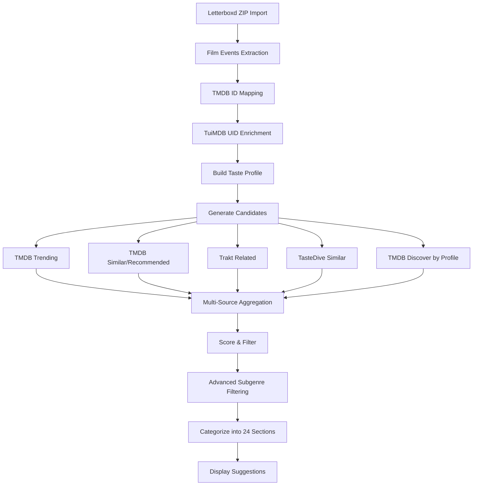

# Suggestion Algorithm Audit Report & Improvement Plan

> [!IMPORTANT]
> **User Feedback Applied**: (1) Remove OMDb completely due to rate limits, (2) Maximize all recommendation sources beyond TMDB

## Executive Summary

The suggestion algorithm is sophisticated with **multi-source recommendation aggregation** from 5+ APIs, **90+ subgenre detection**, **adaptive exploration learning**, and **24 categorized suggestion sections**. However, there are several areas where the Letterboxd user data and available APIs could be utilized more effectively.

---

## Current Flow Analysis



---

## APIs Currently Available & Usage Status

| API | Purpose | Gives Recommendations? | Currently Used? | Usage Quality |
|-----|---------|------------------------|-----------------|---------------|
| **TMDB** | Primary movie data, similar/recommendations | ✅ YES | ✅ Heavily | ⭐⭐⭐⭐ Good |
| **TuiMDB** | 62 enhanced genres, UIDs | ❌ No (data only) | ✅ Partially | ⭐⭐⭐ Could be better |
| **Trakt** | Community-driven related movies | ✅ YES | ✅ Yes | ⭐⭐⭐⭐ Good |
| **TasteDive** | Cross-media recommendations | ✅ YES | ✅ Yes (limited) | ⭐⭐ Underutilized |
| **Watchmode** | Streaming availability, trending | ⚠️ Trending only | ⚠️ Minimal | ⭐⭐ Underutilized |
| **Simkl** | Anime/TV/Movies tracking + recommendations | ✅ YES | ❌ Not Yet | 🆕 **Add This** |
| ~~OMDb~~ | ~~IMDB/RT ratings~~ | ❌ No | 🗑️ **Remove** | Rate limited |

---

## Issues Identified

### 🔴 Critical Issues

#### 1. OMDb Must Be Removed Entirely
**Location**: `src/lib/ratingsAggregator.ts`, `src/lib/omdb.ts`

**Problem**: OMDb has severe rate limits (1,000/day free tier) causing frequent failures. Must be removed completely per user request.

**Action**: Remove all OMDb imports/usage, rely on TMDB `vote_average` + Watchmode `critic_score`.

---

#### 2. Not All Recommendation APIs Being Used
**Location**: `src/lib/recommendationAggregator.ts`

**Problem**: Currently only 4 sources (TMDB, Trakt, TasteDive, Watchmode). Missing Simkl recommendations.

**Action**: Add Simkl API for anime/TV/movie recommendations to diversify beyond mainstream TMDB results.

---

#### 3. TasteDive Underutilized (No Cross-Media Queries)
**Location**: `src/lib/recommendationAggregator.ts`

**Problem**: TasteDive can accept cross-media queries (books, music → movies) but only receives movie titles.

---

#### 4. Letterboxd "Liked" Status Underweighted
**Location**: `src/lib/enhancedProfile.ts`

**Problem**: The weight calculation doesn't give enough distinction between rated-only vs liked films. A 4★ liked film gets same weight as 5★ not-liked, but "liked" is a stronger positive signal.

**Current Weights**:
```typescript
if (rating === 5 && isLiked) return 2.0;
if (rating === 5 && !isLiked) return 1.5;
if (rating === 4 && isLiked) return 1.5;  // Same as 5★ not liked!
if (rating === 4 && !isLiked) return 1.2;
```

---

#### 5. Watchlist Not Used for Discovery Expansion
**Location**: `src/lib/trending.ts`

**Problem**: User's Letterboxd watchlist contains explicit intent signals (genres/directors they WANT to watch) but `generateSmartCandidates` only uses `highlyRatedIds`, not watchlist IDs for discovery.

---

#### 6. No Streaming Availability in Display
**Location**: `src/lib/watchmode.ts`

**Problem**: Watchmode API supports checking where movies are streaming, but this isn't shown to users.

---

### 🟡 Moderate Issues

#### 7. TuiMDB 62 Genres Not Fully Utilized
**Location**: `src/lib/genreEnhancement.ts`

**Problem**: TuiMDB offers 62 genres but only a subset is used for seasonal detection.

---

#### 8. Candidate Pool Limited by Seed Count
**Location**: `src/lib/trending.ts`

**Problem**: Only 10 seed movies used for similar movie fetching, even when user has 100+ highly-rated films.
```typescript
const limitedSeeds = seedIds.slice(0, 10);
```

---

#### 9. No Repeat Prevention Across Sessions
**Location**: `src/app/suggest/page.tsx`

**Problem**: `shownIds` only tracked in React state, cleared on page refresh. Users see repeating suggestions across sessions.

---

### 🟢 Minor/Optimization Issues

#### 10. Subgenre Detection Missing Some Keywords
**Location**: `src/lib/subgenreDetection.ts`

90+ subgenres detected, but some popular categories missing:
- Mumblecore indie dramas
- Cottagecore/cozy aesthetics
- Dark academia themes
- Wuxia martial arts

---

#### 11. Director Discovery Too Narrow
**Location**: `src/lib/trending.ts`

Only top 3 directors used. Users with diverse tastes may have 10+ favorite directors worth exploring.

---

## Proposed Improvements

### Priority 1: Quick Wins (Low Effort, High Impact)

#### P1.1 - Remove OMDb Completely 🗑️
Delete all OMDb usage, rely on TMDB + Watchmode for ratings.

**Files**: `src/lib/ratingsAggregator.ts`, `src/lib/omdb.ts`

---

#### P1.2 - Increase Seed Movie Count
Increase from 10 to 20-25 seeds for similar movie discovery.

**Files**: `src/lib/trending.ts`

---

#### P1.3 - Add Watchlist to Candidate Generation
Pass watchlist IDs to `generateSmartCandidates` for expansion queries.

**Files**: `src/lib/trending.ts`, `src/app/suggest/page.tsx`

---

#### P1.4 - Persist Shown IDs to Supabase
Store shown movie IDs per user to prevent repeats across sessions.

**Files**: `src/lib/enrich.ts`, `src/app/suggest/page.tsx`

---

### Priority 2: Add More Recommendation Sources 🆕

#### P2.1 - Add Simkl API Integration
Simkl offers movie/TV/anime recommendations. Add as 5th source in aggregator.

**New Files**: `src/lib/simkl.ts`, `src/app/api/simkl/route.ts`

---

#### P2.2 - Enhance TasteDive with Cross-Media Queries
Query based on books/music the user might like (inferred from film themes).

**Files**: `src/lib/tastedive.ts`, `src/lib/recommendationAggregator.ts`

---

#### P2.3 - Add Streaming Availability Display
Fetch and display where each suggestion is streaming (Netflix, Prime, etc.)

**Files**: `src/lib/watchmode.ts`, `src/components/MovieCard.tsx`

---

#### P2.4 - Better "Liked" Weight Differentiation
Increase weight gap between liked and non-liked films at same rating.

**Files**: `src/lib/enhancedProfile.ts`

---

#### P2.5 - Show Recommendation Source on MovieCard 🆕
Display which API(s) recommended each movie (e.g., "TMDB + Trakt" or "TasteDive") for transparency.

**Files**: `src/components/MovieCard.tsx`

---

### Priority 3: Higher Effort Improvements

#### P3.1 - "Available To Stream" Filter
Add toggle filter for streaming services.

**Files**: `src/app/suggest/page.tsx`

---

#### P3.2 - Expand Subgenre Keywords
Add 20+ more subgenre keyword mappings.

**Files**: `src/lib/subgenreDetection.ts`

---

## Verification Plan

### Automated Tests
- No existing tests found in project
- **Recommendation**: Create integration tests for scoring algorithm

### Manual Verification
For implemented improvements:
1. **Import test Letterboxd data** (user's actual data)
2. **Generate suggestions** before and after changes
3. **Compare:**
   - Repeat rate (should decrease with P1.4)
   - Diversity of results (should increase with P1.2, P1.3)
   - Ratings visibility (verify TMDB ratings show consistently)
   - Category distribution (verify all 24 sections populated)

---

## Recommended Action Plan

| Priority | Task | Effort | Impact |
|----------|------|--------|--------|
| **P1.1** | Remove OMDb completely | 30 min | Eliminates rate limit errors |
| **P1.2** | Increase seed count 10→25 | 5 min | More diverse recs |
| **P1.3** | Add watchlist to discovery | 30 min | Uses intent signals |
| **P1.4** | Persist shown IDs | 1 hour | No session repeats |
| **P2.1** | Add Simkl recommendation API | 2 hours | New unique movies |
| **P2.2** | Enhance TasteDive cross-media | 1 hour | Better hidden gems |
| **P2.5** | Show rec source on MovieCard | 30 min | User transparency |
